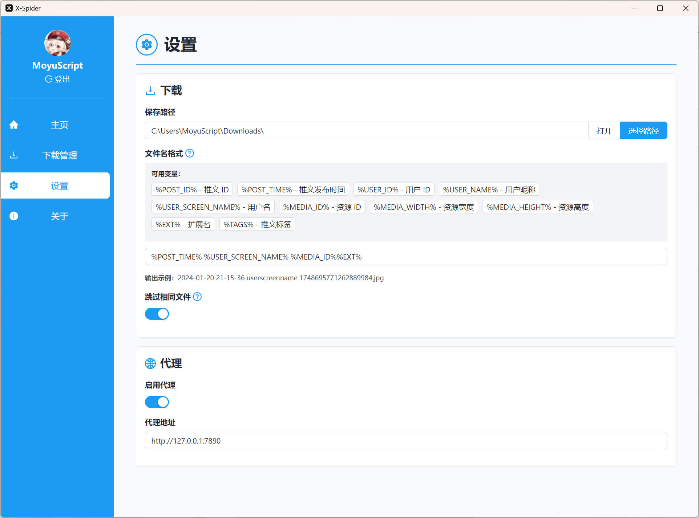

# X-Spider

一个推特媒体（图片、视频）下载器。

## 下载

[Releases](https://github.com/MiningCattiva/x-spider/releases)

## 功能

- 媒体过滤器（如指定下载日期范围）
- 跳过已下载文件
- 可配置文件名格式
- 代理
- Cookie 登录

## 软件截图

## 给猫猫喂口红色莓果

[爱发电](https://afdian.net/a/moyuscript)
